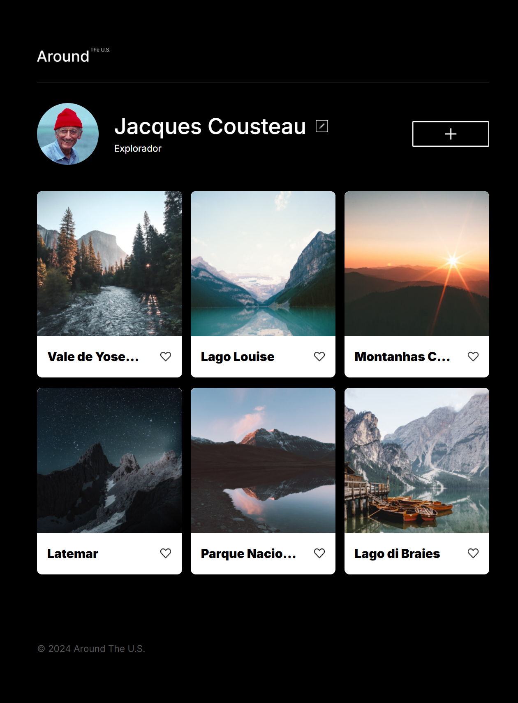
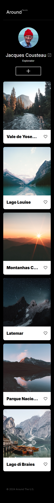

# Around The U.S.

**▶️ Visualizar Projeto Online** [https://douglasargenta.github.io/around_project_service/]

Este projeto é uma plataforma web para compartilhar fotos de lugares ao redor do mundo, com foco em um perfil de usuário interativo e uma galeria de imagens dinâmica. O design é totalmente responsivo, garantindo uma experiência de usuário fluida em diferentes dispositivos.

## Visão Geral do Projeto

Este projeto implementa uma página web responsiva que simula uma rede social de compartilhamento de fotos. Os usuários podem visualizar um perfil com informações pessoais, editá-las, e interagir com uma galeria de imagens, adicionando novos cartões de lugar e marcando suas fotos favoritas.

O desenvolvimento focou na criação de um layout adaptável que se ajusta perfeitamente desde desktops (1280px) até dispositivos móveis (320px), com particular atenção ao alinhamento de elementos e à interatividade da interface.

## Funcionalidades e Características

- **Perfil de Usuário Interativo:**
  - Exibe o nome e a descrição do usuário.
  - Botão para editar o nome e a descrição, com a abertura de um modal (popup).
- **Galeria de Imagens Dinâmica:**
  - Apresenta uma coleção de cartões de lugar com imagens e títulos.
  - Botão para adicionar novos cartões de lugar.
  - **Botões para curtir e remover cartões.**
- **Validação de Formulário:** Implementação de uma classe universal de validação para garantir a integridade dos dados inseridos nos formulários, fornecendo feedback em tempo real ao usuário.
- **Pop-ups Interativos:**
  - Exibição de um pop-up com a imagem em tamanho real ao clicar em um cartão.
  - Todos os pop-ups podem ser fechados.
- **Responsividade Abrangente:** A página se adapta a diversos tamanhos de tela, desde desktops grandes até smartphones (320px), sem rolagem horizontal indesejada, garantindo um alinhamento consistente dos elementos (como o botão de adicionar e o rodapé).
- **Design Fiel:** Elementos visuais, espaçamentos, tipografia (`Fonte Inter`) e cores foram implementados de acordo com os designs fornecidos, buscando precisão.
- **Flexbox para Layouts:** Utilização de Flexbox para o alinhamento e distribuição eficiente de itens em diversas seções, como o cabeçalho, o perfil e os cartões da galeria.
- **Metodologia BEM:** As classes CSS seguem a metodologia BEM (Bloco Elemento Modificador) para garantir um código organizado, escalável e de fácil manutenção.
- **Estrutura Semântica:** O HTML é estruturado semanticamente, utilizando as tags apropriadas para cada tipo de conteúdo, promovendo acessibilidade e manutenibilidade.
- **Otimização de Imagens:** Uso de `object-fit: cover` para garantir que as imagens se adaptem visualmente aos seus contêineres mantendo a proporção.
- **Interatividade e Arquitetura POO (Programação Orientada a Objetos):**
  - Implementação de funcionalidades dinâmicas usando **Classes ES6** (`Card.js`, `PopupWithForm.js`, `Section.js`, etc.) para modularizar e encapsular a lógica de interação da interface.
  - Gerenciamento de eventos de clique e submissão de formulários para manipular o DOM.

## Tecnologias Utilizadas

- **HTML5:** Para a estrutura e conteúdo semântico da página.
- **CSS3:** Para a estilização e responsividade, com ênfase em:
  - **Flexbox**
  - Media Queries
  - Unidades Relativas (px, em, %)
  - `box-sizing: border-box` (reset para modelagem de caixa intuitiva)
  - `object-fit`
- **JavaScript:** Para toda a lógica de interatividade e manipulação do DOM, utilizando o paradigma de **Programação Orientada a Objetos (POO)** com **Classes ES6** para modularidade e encapsulamento.
- **Fonte Inter:** Utilizada para a tipografia do projeto, importada via Google Fonts.

## Estrutura de Arquivos

O projeto segue a metodologia BEM Flat para a organização dos arquivos e pastas:

/
├── .editorconfig
├── .gitignore
├── .prettierignore
├── README.md
├── index.html
├── images/
│ ├── add-button.png
│ ├── logo.png
│ ├── profile-image.jpg
│ └── (outras imagens e ícones)
└── src/
├── blocks/
│ ├── elements.css
│ ├── footer.css
│ ├── header.css
│ ├── page.css
│ ├── places.css
│ ├── popup.css
│ └── profile.css
├── components/
│ ├── Card.js
│ ├── FormValidator.js
│ ├── Popup.js
│ ├── PopupWithForm.js
│ ├── PopupWithImage.js
│ ├── Section.js
│ └── UserInfo.js
├── pages/
│ ├── index.css
│ └── index.js
├── utils/
│ └── constants.js
└── vendor/
└── normalize.css

### Visualização do Projeto

Para uma melhor compreensão dos recursos, aqui estão algumas capturas de tela do projeto em diferentes seções:

**Visualização em Desktop (Exemplo):**

**Visualização em Mobile (Exemplo):**

## Planos de Melhoria

Para futuras iterações e aprimoramento do projeto, planejo explorar:

1. **Animações e Transições:** Adicionar transições e animações CSS/JS mais suaves para uma experiência de usuário aprimorada.
2. **Conexão com API:** Integrar o projeto com uma API externa para buscar e salvar dados do usuário e dos cartões de forma persistente.

## Contato

[Douglas Argenta]
[blogdouglasargenta@gmail.com]
